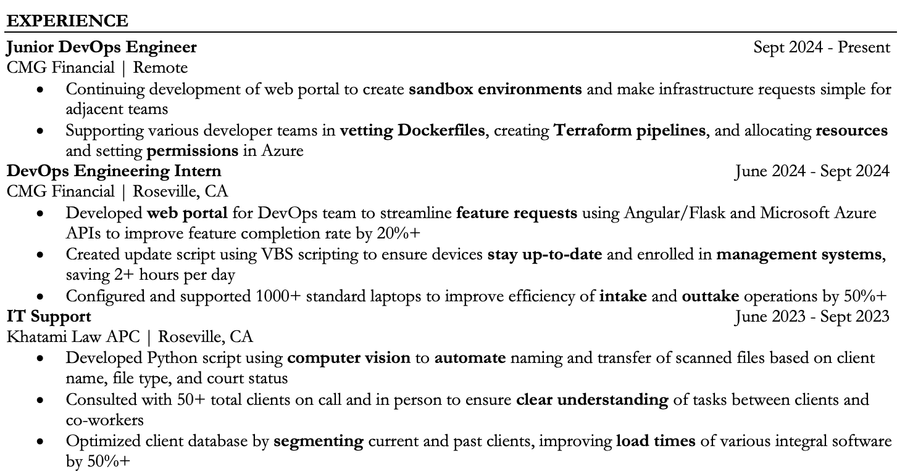
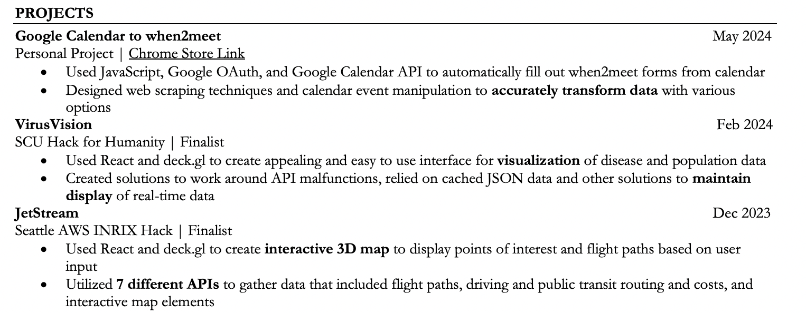
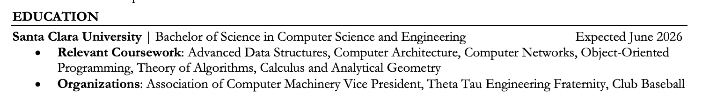
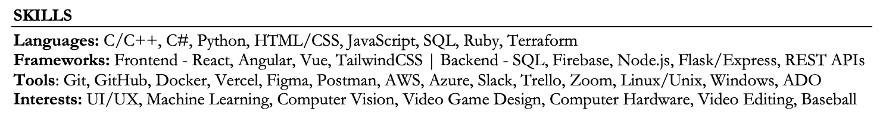

# Resume Guide

Written by Jake Esperson, 2025.

Putting your entire academic and professional career on a single page is a very difficult task. Not only that, but this is the first impression you will make on a potential employer, so taking the time to make it as good as possible is very important. However, by following a few guidelines, you can make a resume that beats the algorithms and increases your chances of landing an interview!

## Table of Contents
- [Resume Guide](#resume-guide)
  - [Table of Contents](#table-of-contents)
  - [Where do we start?](#where-do-we-start)
    - [Minimalist Design](#minimalist-design)
    - [Beating the ATS](#beating-the-ats)
    - [Very commonly used](#very-commonly-used)
  - [What should go on a resume?](#what-should-go-on-a-resume)
    - [Contact Information](#contact-information)
    - [Experience](#experience)
    - [Projects](#projects)
    - [Education](#education)
    - [Skills](#skills)
    - [Optional Sections](#optional-sections)
  - [Let's Talk Cover Letters](#lets-talk-cover-letters)
  - [Conclusion](#conclusion)

## Where do we start?
For the purposes of following along and having a great starting point, I recommend using Jake's Resume template. It isn't my actual template haha, rather a well known and excellent template. Using a template is totally fine and has several advantages that I will go over in a second, so don't think you need to get super creative with your resume layout. You can download it with [this link](https://jakesresume.com/download/) and I'll go over the advantages here.

### Minimalist Design
The template is designed to be clean and easy to read. It uses a minimalist design that allows the reader to quickly scan the resume and find the information they are looking for. This is more advantageous than a flashy design that may look good, but is difficult to read for not only a human, but also the technology in the next section.

### Beating the ATS
The ATS, or Applicant Tracking System, is a software that many companies use to filter resumes. It scans resumes for keywords and phrases that are relevant to the job description. If your resume doesn't include these keywords, it may be automatically rejected before a human even sees it. By using this template, you can ensure that your resume is ATS-friendly because it designed to be easy for computers to extract words from and includes sections for all of the important information that employers are looking for.

### Very commonly used
The template is very commonly used, so it is likely that the person reading your resume will be familiar with it. This means that they will be able to quickly find the information they are looking for without having to spend time trying to figure out what each section means.

## What should go on a resume?
A resume is, at it's core, a summary of your academic and professional skills that are relevant for the job that you are applying for. However, you are limited to a single page, so you need to be very careful about what you include. Therefore, I'm going to go over the most important sections of a resume with examples from my own resume.

### Contact Information

This section is pretty straightforward. It should include your name, professional email address, phone number, and LinkedIn profile at a minimum. You can also include your GitHub profile or personal website if you have one. Make sure to put your legal name as well, as you can see by mine saying "Jakob" instead of "Jake".

### Experience

This section is the most important part of your resume. Ideally, it should include 2-3 relevant work experiences for the position you are applying for. If you don't have any relevant work experience, you can include volunteer work, non-relevant work experience, and anything that may help your candidacy for a job. Each experience should include your job title, the company you worked for, the location of the position, and the dates you worked there.

You should also include bullet points that describe your responsibilities and accomplishments in each position. Each point should start with an action verb and be written in the past tense. The structure should include the the task, what action you took, and the quantifible impact of your work. You should also try to quantify your accomplishments whenever possible. For example, instead of saying "Made a web portal to improve teamwork", I said "Developed web portal for DevOps team to streamline feature requests using Angular/Flask and Microsoft Azure APIs to improve feature completion rate by 20%+". I also chose to bold relevant phrases such as technologies, but you don't have to do this. If you'd like to learn more about this, check out the STAR method in our interviewing guide.

This is where the majority of your time should be spent when writing your resume, so consider reaching out to some peers and mentors to get feedback on this part. You can also reach out to ACM or even the Career Center with any questions you may have.

### Projects

As CS students, we have the luxury of sitting down at our computers and making projects whenever we want, very cool! However, that mean employers are going to expect you to have some projects on your resume. This can be anything from a hackathon project (wonder who can help you with that 😉) to a personal or class project. What you're looking for is anything that proves you can code outside of just what's expected of you, using technologies that are more relevant to the industry than things they may teach you in class. When it comes to layout, it's pretty straightforward, but it's always good to include links to GitHub repos, download links, or even Devposts. Like in the experience section, be sure to include relevant technologies, team role if you worked in a team, and the impact of your project.

### Education

I like to keep the education section pretty simple, as there isn't much you can do to set yourself apart from others. You should include your school, degree, and expected graduation date. If you have a high GPA (3.5 or higher), feel free to include that as well. Relevant coursework is also a good call, along with any awards and organizations you might be a part of.

### Skills

The skills section is simply a list of all languages, tools, and frameworks you are familiar with. How familiar with a language to put it in this section can be tough, but if you have either used it in a project or are familiar with most of the syntax, even with Google, that's good enough for me. Another thing to consider would be general interests, as this can be a good conversation starter in an interview.

### Optional Sections

There are a few sections that you can include if you're looking to fill up space or if you have a lot of relevant experience. These include:
- Summary (A short summary of why you are a good fit for the position)
- Involvements (I had this for my ACM and Theta Tau leadership expereinces for a while)
- Certifications (AWS, Google Cloud, etc.)
- Awards (Dean's List, etc.)

Overall, especially for underclassmen who may not have a lot of experience yet, these sections can be good fillers. However, make sure to keep it to 1 page and keep the information relevant as best you can.

## Let's Talk Cover Letters

A cover letter is a document that you send along with your resume when applying for a job. It is an opportunity to introduce yourself to the employer and explain why you are a good fit for the position. Personally, I tend to not include a cover letter unless it is specifically requested. Most of the time they aren't even looked at and can be more effort than they are worth. However, if you do choose to include one, make sure to keep it short and to the point. It should be no more than one page long, should address a hiring manager directly (do some research!), and should include the following sections:
- Introduction (Who you are and what position you are applying for)
- Body (Why you are a good fit for the position and what you can bring to the company)
- Conclusion (Thank the employer for their time and express your interest in the position)

## Conclusion
Overall, writing a resume can be a difficult task, but by following these guidelines, you can create a resume that will help you stand out from the competition. An important reminder is to keep your resume up-to-date and to tailor it to each job you apply for. This means that you should adjust the experience and projects sections to include the most relevant information for the position you are applying for.

Remember, if you have any questions, check out the [Career Center](https://www.scu.edu/careercenter/) or you can always email [acm@scu.edu](mailto:acm@scu.edu) with any questions and we'd love to give a quick review! Good luck with your job search and we hope to see you at our next event!

