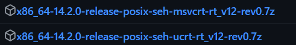
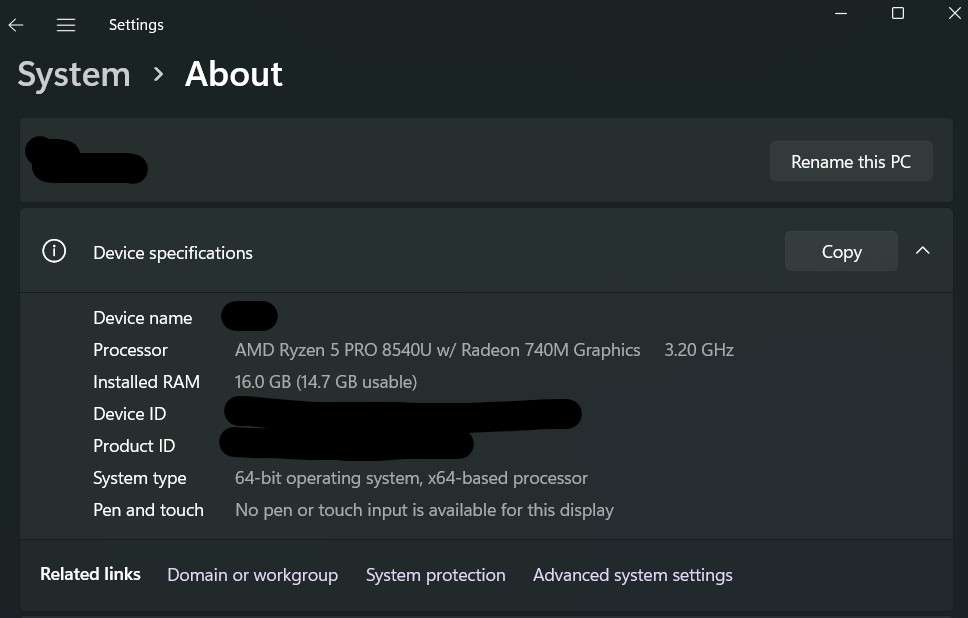
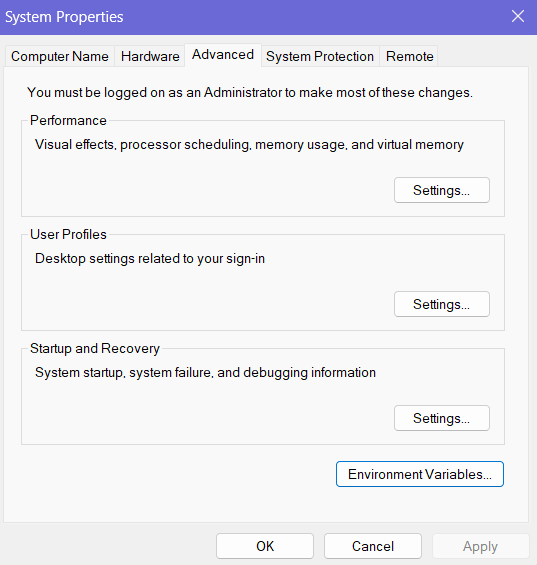
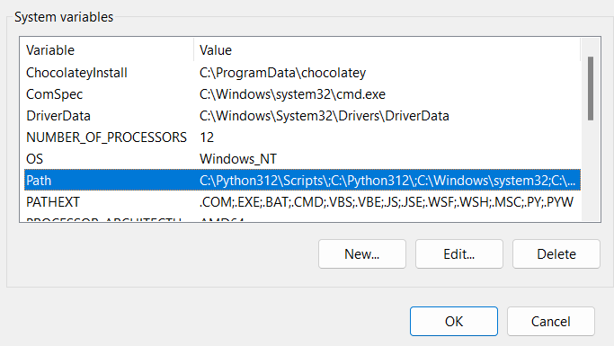
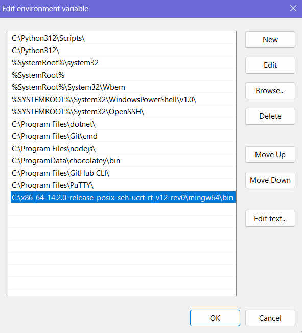
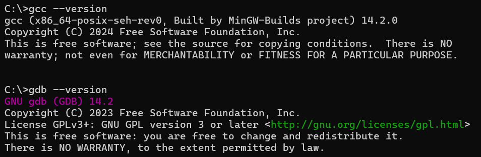
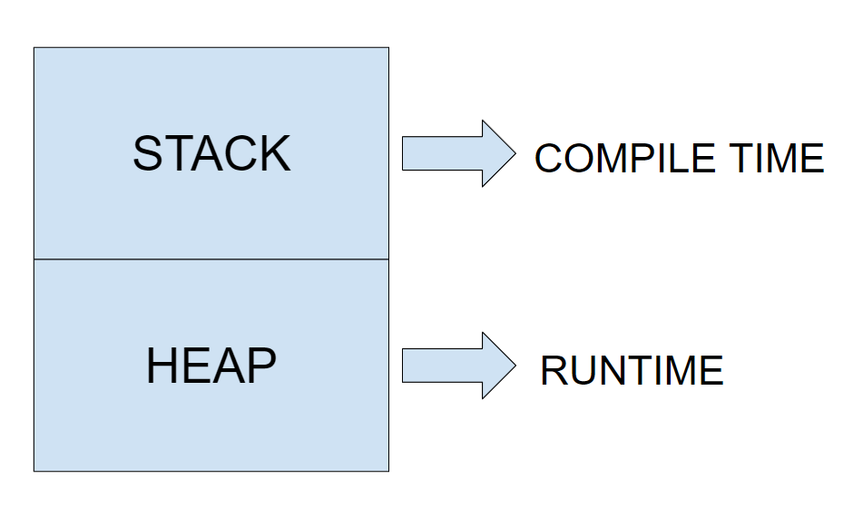

# C Tutorial

Written by Ivy Zhuang, 2024.

## Table of Contents
[C Tutorial](#c-tutorial)
- [Table of Contents](#table-of-contents)
- [What is C?](#what-is-c)
- [How to run C](#how-to-run-c)
- [Installation](#installation)
    - [Windows](#windows)
    - [macOS](#macos)
- [Compiling with GCC](#compiling-with-gcc)
- [Getting Started](#getting-started)
- [Variables & Data Types](#variables--data-types)
- [Arrays](#arrays)
- [Input & Output](#input--output)
- [Control Statements](#control-statements)
- [Functions/Methods](#functionsmethods)
- [Structs & Unions](#structs--unions)
- [Pointers](#pointers)
- [Dynamic Memory Allocation](#dynamic-memory-allocation)

## What is C?

C is what many regard as the first modern programming language. It's a general purpose programming language and is known for its usage of pointers and memory allocation. Many popular programming languages are based off of C's principles and syntax. At SCU, C is taught in CSEN's foundational courses (CSEN 10-12). The purpose of this tutorial is to give you easy-to-access help on these CSEN courses or to guide anyone at SCU interested in learning C.

## How to run C

After you write any program in C, you have to compile it into an executable file.

1. The easiest is to use an online code editor like [onlinegdb.com](https://www.onlinegdb.com/online_c_compiler). 

2. At SCU, we use the GNU Code Compiler (GCC) in our CSEN courses and this tutorial will help you set up GCC on your local computer.

3. If you mainly want to focus on just learning C, another option is [Code::Blocks](https://www.codeblocks.org/) which automatically runs your code locally without having to download the compiler separately or work in the terminal. 

**Ultimately, it's up to you on how you want to compile and execute your code. You should make this decision based on how you plan on learning C.**

## Installation

This tutorial will be using the GNU Code Compiler (GCC) to compile and run code written in C. It's also recommended to install the GNU Debugger (GDB) and the GNU C++ Compiler (G++) if you plan on learning C++ later.

### Windows
The process of installing GCC on Windows is a bit of a tedious task. We will be installing a MinGW build, which provides GCC and other libraries needed to compile and execute C.

1. Install a compressed archive of MinGW from [here](https://github.com/niXman/mingw-builds-binaries/releases). For 64-bit Windows, install a release with "x86_64", "posix", and "seh" in the filename. For example:



2. Extract the file contents into a location in your file system that you'll remember.

3. Go to the folder where you saved MinGW and navigate to the bin directory. Copy the path to the "bin" directory in your MinGW build. Typically, it would be **"C:\\...\mingw64\bin"**.


4. Paste the copied path into your path aka environment variables (commands you can use in the terminal). To do so, go to Settings → System → About → Advanced System Settings → Environment Variables.




5. Look for the "Path" variable under System Variables. Click the "Edit" button and then add a new line with the copied path.




### macOS
1. Install Homebrew, a package manager for macOS.
2. Install GCC using the following command:
```shell
brew install gcc
```
3. (Optional) Use the same command to install GDB.

When you're done, type ` gcc --version` (and `gdb --version` if you installed it) in the terminal or command prompt to check if everything installed properly.



## Compiling with GCC

GCC compiles code written in C to an executable file. To use GCC, call it in the terminal:

```shell
gcc -o <name> file1.c <etc.>
```
The -o flag indicates the name of the executable to be created. Following that are the file(s) that are being compiled. Don't keep the triangular brackets <>. After you compile, you can call the executable in the terminal with its name to run your code.

```shell
gcc -o unique unique.c unsorted.c
./unique
```

If you're unfamiliar with using the terminal, check out MIT's Missing Semester in the [Further Learning](#further-learning) section. You can also look at the [GCC manual](https://man7.org/linux/man-pages/man1/gcc.1.html) to learn more about it and its options.

## Getting Started

For a C program to run, it needs a main function. The executable file automatically calls the main function and runs it line-by-line.

```c
int main() {
    // your code here
}
```

Every time you compile your code, make sure to have one main function in one of the files.

Comments are written in C by starting the line with a double forward slash. A comment is a line of code that is not considered by the compiler, but used to clarify programming logic.

Most methods and operators we need in C have to be included at the top of the file.

```c
// standard input/output library
#include <stdio.h>
// other commonly used libraries
#include <stdlib.h>
#include <assert.h>
#include <stdbool.h>
#include <string.h>
```

## Variables & Data Types

To declare a variable in C:

```c
int x = 0;
// or
char y;
```

Start the line with the variable type then followed by the variable name. You can optionally include an initial value for the variable. Here is a list of some common data types in C:

| Type | Description |
| - | - |
| int | An integer ranging from -(2^31-1) to 2^31-1. |
| char | A single character. |
| float | A floating-point number with up to 6 digits after the decimal of precision. |
| void | A data type of "no type". Usually used for functions and pointers. |

## Arrays

An array is a fixed number of variables or elements all the same type that can be accessed from a single name. If you have experience with other programming languages, the syntax will be familiar.

To create an array, it's similar to declaring a variable but indicate the number of elements in square brackets.

```c
int arr[7] = {3,6,2,5,4,0,1};
char str[] = "The A in ACM stands for Amazing.";
float grades[23];
```

If you want to set initial values for an array, put those values in curly brackets like the first example.

The second example is a special case of a string. In C, strings are simply char arrays. You can set their initial values using quotation marks instead. Additionally, when you set initial values for an array in C, it's not necessary to set an array size.

To access an element in an array, you specify the index in square brackets. Arrays in C are 0-indexed. This means that array indices are in range from 0 to length of array - 1.

```c
arr[3]; // = 5
str[0]; // = 'T'
grades[2] = 95.8;
```

## Input & Output

Remember to include the standard input/output library for this section. The two methods we'll be covering are:

- printf
- scanf

**Printf** is the output function.
```c
#include <stdio.h>
int main() {
    printf("Hello World!");
}
```

Printf will output anything in the double quotation marks within its round brackets as shown above.

Remember to include a semicolon at the end of most lines of code! Every function in C is followed by round brackets ().

If you are printing multiple lines, make sure to use the escape character **\n** to add a new line. Printf() does not add a new line after it automatically. For example:

```c
printf("Hello");
printf("World");
// output:
// HelloWorld
printf("Hello\n");
printf("World\n");
// output:
// Hello
// World
```

The f in printf stands for "format" and we can use format specifiers to indicate what type of variable we're outputting. For example:

```c
int x = 7;
printf("%d", x);
char s[] = "The A in ACM stands for Amazing.";
printf("%s", s);
```

Each format specifier has its own designated character and type. Here's a list of common specifiers:

| Type | Format Specifier |
| ---- | ---------------- |
| int | %d |
| char | %c |
| float | %f |
| string | %s |

We also use these format specifiers to scan input in C.

```c
// Examples
char name[20];
scanf("%s", &name);
float age;
scanf("%d", &age);
```

Scanf() will read input in the format in the quotations and then store the input in the specified variables. There has to be an ampersand (&) before the variable name for the input to be stored properly. We'll get into what the ampersand really does later on.

## Control Statements

Control statements are lines of code that dictate whether or how many times a block of code runs. This tutorial will focus on the three most common types of control statements in C.

Firstly, **if statements** control whether a block of code runs or not.

```c
if (grade > 70) {
    printf("%d passes.", grade);
}
```

In the above example, we check the condition of n greater than 100 and run the code within the curly brackets if it's true. Control statements all have end with an opening curly bracket and have a matching closing curly bracket after a block of code. The code block in the curly brackets is typically indented for better readability.

If statements can be followed by else-if and else statements which are checked in sequence when previous if/else-if statements don't pass.

```c
if (grade > 70) {
    printf("%d passes.", grade);
}
else if (grade > 65) {
    printf("There's still a tiny chance.");
}
else {
    printf("It's joever.");
}
```

Secondly, **while loops** are structured similarly to if statements except that it will repeatedly run the code block as long as the condition is true. For example:
```c
while (n < 10) {
    n++; // increment by one
    printf("%d", n);
}
```
Take care to not run into infinite loops!

Thirdly, **for loops** iterate through a range of values specified in its statement. For example:
```c
for (int i=0; i<n; i++) {
    printf("%d", i);
}
```
The statement in the round brackets defines an integer variable i that starts at 0 which increases by 1 for each iteration until i doesn't fulfill the condition of i < n.

## Functions/Methods

To declare a function in C, you start with the return type followed by the function's name and its parameters in round brackets. The code for the method in indented and sandwiched between curly brackets.

```c
// Some examples
int average(int a, int b) {
    return (a+b)/2;
}

void helloWorldNTimes (int n) {
    for(int i=0;i<n;i++) {
        printf("Hello World\n");
    }
    // void functions don't have to return anything
}
```

Function names are usually written in camel case (capitalize first letter of each word except the first) in C.

A function's parameters are passed in round brackets after the function name. A parameter is a value you are passing into a function. For each parameter, you have to indicate its type.

If your function's return type is not void, you must return a value of said return type.

## Structs & Unions

If you have experience with other high-level programming languages, you may be familiar with classes. While C doesn't have classes, structs and unions are can be similar to them.

Structs allow you to create a data type consisting of multiple variables bundled together. For example:

```c
#include <string.h> // strcpy is from this library

struct Student {
    int age;
    float gpa;
    char name[20];
    char major[50];
};

int main() {
    // declare a struct instance
    struct Student stu1 = {18, 4.0, "Billy", "Math"};
    struct Student stu2;
    // access struct members and change their values
    stu2.age = 19;
    stu2.gpa = 3.7;
    strcpy(stu2.name, "Mark Antony");
    strcpy(stu2.major, "Underwater Basket-Weaving");
}
```

A union is similar to a struct in its syntax, except that only one member of the union can have a set value at a time. You can think of it as a variable that can have different data types.

```c
struct Student {
    int age;
    char name[20];
    char major[50];
    union grade {
        float gpa;
        char letter;
    } grade;
} john;

int main() {
    john.grade.letter = 'A';
    john.grade.gpa = 3.4;
    printf("GPA: %f, Letter: %c", john.grade.gpa, john.grade.letter);
}
```

In the above example, the output would've been:

```
GPA: 3.400000, Letter: �
```
The value at john.grade.letter is a garbage value since john.grade.gpa has been assigned a value more recently.

Additionally, you can name an instance of a struct or union by stating the name after the closing curly bracket. In the above example, the struct Student variable is called "john" and the union within the struct is called "grade". To contain a union in a struct and vice versa, the struct/union must have a name to reference.


## Pointers

Whenever you're programming and create new variables, memory has to be allocated to said variables and each will have a **memory address** aka a **pointer**. To access a variable's memory address, type an ampersand before the variable name.

```c
int num = 8;
printf("%p\n",&num);
char name[20];
scanf("%s", &name); // recall from the input section!
```
This is called **referencing a pointer**. A pointer is what stores the memory address. To print a pointer or memory address, we can use the %p format specifier. Additionally, recall that we use the same ampersand symbol for the second parameter in scanf. This is because we are referencing the pointer to provide where in memory the input will be stored.

We can also pass this memory address to a **pointer variable**. Declaring a pointer variable is similar to declaring any other variable. Just add an asterisk (*) before the variable name.

```c
int *pNum = &num;
```

The asterisk symbol can also **dereference a pointer**, which will return the value stored at the memory address of the pointer.

```c
printf("num = %d is stored at %p.", *pNum, pNum);
```

Asterisk and ampersand symbols essentially do the opposite of each other. We can actually do use them each other to cancel each other out.

```c
printf("%d\n", *&*pNum);
printf("%p", &*&*&*&num);
```

## Dynamic Memory Allocation

To understand what dynamic memory allocation, we need to understand what the stack and heap are in memory allocation. 

When you declare variables normally in C, they are **stack-allocated**. This is also called **static memory allocation**. In this case, variables are allocated by the program in **compile time**. Compile time refers to when the compiler converts your code to binary instructions. These instructions tell the computer how much memory to reserve for certain variables. Memory that is stack-allocated at compile time is allocated and deallocated in a defined order.

On the other hand, memory allocated in **runtime** are **heap-allocated**. This is what we call **dynamic memory allocation**. Runtime refers to when your program is actually running. By dynamically allocating memory, we can be more flexible and efficient with our memory usage! Typically, we heap-allocate memory when we're unsure of how much memory we need or to get around memory limits in the stack. Dynamic memory allocation can also create global variables which can be accessed anywhere in a program. Memory can be allocated and deallocated in any order within the heap. However, when we dynamically allocate memory, we should be careful of memory leaks and manage our memory carefully.



First, let's learn how to dynamically allocate memory in C. There are four functions to do so in C:

- malloc
- calloc
- realloc
- free

All of these are included in stdlib.h.

Malloc is short for memory allocation. You can allocate a contiguous block of memory to a pointer by indicating the number of bytes.

```c
int *px = (int*) malloc(sizeof(int));
```

The sizeof() operator returns the number of bytes of a data type.

Malloc returns a void pointer which is essentially a pointer that can point to any data type. It's good practice to type cast after calling malloc.

You can store multiple values at a pointer as well, similar to an array.

```c
char *word = (char*) malloc(sizeof(char) * 10);
char **sentence = (char**) malloc(sizeof(char*) * 10);
```

The first example is a char pointer that points to 10 char values. You can think of it as a string allocated in runtime.

The second pointer is a **double pointer**, which points to 10 char pointers. A double pointer is basically just a pointer pointing at another pointer. If a string can be represented as a char pointer and a pointer is like an array, then a double pointer is simply an array of strings.


You can access values that pointers are referencing by the same syntax as arrays or **pointer arithmetic**.

```c
printf("%c", word[2]);
printf("%c", *(word+2));
```

The above printf statements will have the same output. Square brackets in C are just shorthand for *(pointer + i), where i is the index. By adding to a pointer, you can access the memory at a specific index and then dereference it (\*) to get its value. Since we allocated 10 * sizeof(char) to word earlier, we can access memory from word up to word + 9.

There's always the possibility that malloc fails and cannot allocate a certain amount of memory for the program. In these cases, it will return NULL instead of pointer. As such, it's important to check if a pointer is NULL after allocation. The NULL value is also included in stdlib.h.

```c
// Example 1: if statement
if (word == NULL) {
    printf("Memory not available.");
    return;
}

// Example 2: assert
#include <assert.h>
assert(word != NULL);
```

Calloc is similar to malloc as it also allocates a contiguous block of memory to a pointer. However, it takes two parameters instead.

```c
int *arr = (int*) calloc(10, sizeof(int));
```

The first parameter is the number of memory blocks you want to reserve. The second parameter is the size of each memory block. The equivalent malloc statement would be:

```c
int *arr = (int*) malloc(10 * sizeof(int));
```

Unfortunately, what calloc is short for has been lost in history.

Realloc is short for reallocation. As the name suggests, it lets you reallocate previously dynamically memory.

```c
int *arr = (int*) malloc(10 * sizeof(int));
arr = (int*) realloc(arr, 15 * sizeof(int));
```

The first parameter is a pointer to heap-allocated memory. The second parameter is the new number of bytes to allocate. 

Realloc will return a new pointer that maintains the pre-existing values stored at that memory address but with a different number of bytes allocated. However, if you reallocate to a smaller size, some of your pre-existing values won't be saved.

Note that you can only use realloc on dynamically allocated memory.

Finally, there's free, which release dynamically allocated memory. It only takes one parameter, which is the pointer to the memory you want to deallocate. Free will return nothing.

```c
free(arr);
arr = NULL;
```

Whenever you don't need to access dynamically allocated memory anymore, you should always release it. If you don't free properly, it will result in a **memory leak**. This is when there's a build-up of memory usage in your program which will eventually cause it to crash. Additionally, it's good practice to assign pointers to NULL once their memory has been freed.

The last thing to look out for in dynamic memory allocation are **segmentation faults** aka **segfaults**. A segfault occurs in runtime when the program attempts to access memory it doesn't have permission to. Some examples of when this can happen are:

- Accessing previously freed memory
- Realloc on a pointer of stack-allocated memory
- Modifying a string literal
- Dereferencing a NULL pointer
- And many more!

## Further Learning

Our C++ tutorial! (add a link here later)

Useful Practice:
- [C Quiz from W3Schools](https://www.w3schools.com/c/c_quiz.php)
- Learn about [C99](https://en.wikipedia.org/wiki/C99) to write more readable code

SCU Resources:
- Pointers about Pointers Workshop by ACM-W (another link needed here)

Textbooks for CSEN 10-12:
- The C Programming Language (2nd Ed.) by Brian W. Kernighan & Dennis M. Ritchie
- Data Structures - A Pseudocode Approach with C by Richard F. Gilberg & Behrouz A. Forouzan

Other:
- Another C compiler: [Clang](https://clang.llvm.org/)
- Learn more about [segfaults](https://en.wikipedia.org/wiki/Segmentation_fault)
- [MIT Missing Semester](https://missing.csail.mit.edu/) to learn more about the command line, shell, vim, etc.