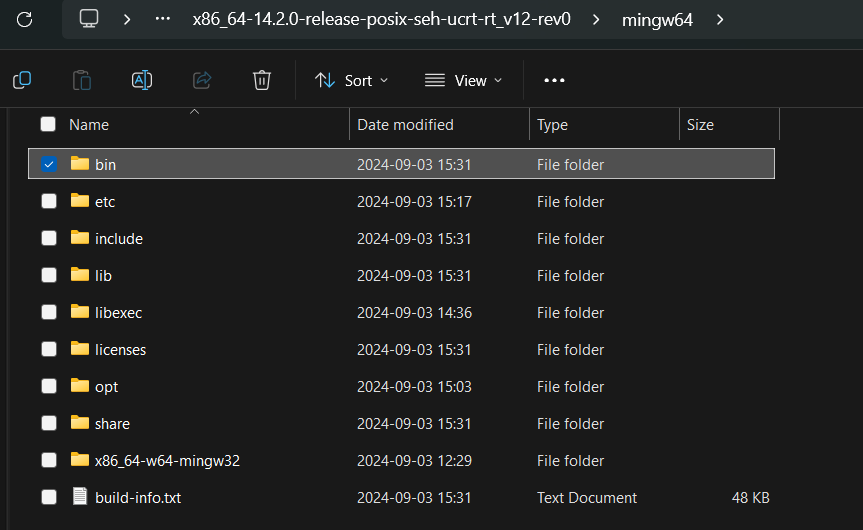

# C Tutorial
Written by Ivy Zhuang, 2024.
## What is C?

C is what many regard as the first modern programming language. It's a general purpose programming language and can be described as low-level with its usage of pointers and memory allocation. Many popular programming languages are based off of C's principles and syntax, some even running C in the background. At SCU, C is taught in CSEN's foundational courses (CSEN 10-12). The purpose of this tutorial is to give you easy-to-access help on these CSEN courses or to guide anyone at SCU interested in learning C.

## Installation

This tutorial will be using the GNU Code Compiler (GCC) to compile and run code written in C. It's also recommended to install the GNU Debugger (GDB) and the GNU C++ Compiler (G++).

### Windows
The process of installing GCC on Windows is a bit of a tedious task. You have 3 choices for installation methods:
1. Overkill: Use a package manager like MSYS.
2. Simple: Download a MinGW build and add it to your PATH manually.
3. WSL: If you're

The overkill method: [follow this tutorial](https://www.freecodecamp.org/news/how-to-install-c-and-cpp-compiler-on-windows/).

The simple method:
1. Install a compressed archive of MinGW from [here](https://github.com/niXman/mingw-builds-binaries/releases). For Windows x64, install a release with "x86_64", "posix", and "seh" in the filename.

2. Extract the file contents into a location in your file system that you'll remember (preferably not your downloads folder).
3. Copy the path to the "bin" directory in your MinGW build. Typically, it would be **"C:\\...\x86_64-14.2.0-release-posix-seh-ucrt-rt_v12-rev0\mingw64\bin"**

4. Paste the copied path into your path aka environment variables (commands you can use in the terminal). To do so, go to 

WSL:

When you're done, type ```gcc --version``` and ```gdb --version``` to check if everything installed properly.

### MacOS
1. Install Homebrew, a package manager for Mac.
2. Install GCC using the following command: ```brew install gcc```
### Linux
If you're using a Linux distro and don't know how to install packages...

## Running GCC

## Input & Output

## Variables & Types

## Arrays

## Pointers

## Functions

## Structs & Unions

## Dynamic Memory Allocation

## Further Learning
Our C++ tutorial! (add a link here later)
Useful Practice:
- a

SCU Resources:
- Tutoring

Textbooks for CSEN 10-12:
- The C Programming Language (2nd Ed.) by Brian W. Kernighan & Dennis M. Ritchie
- Data Structures - A Pseudocode Approach with C by Richard F. Gilberg & Behrouz A. Forouzan

Other:
- Another C compiler: Clang